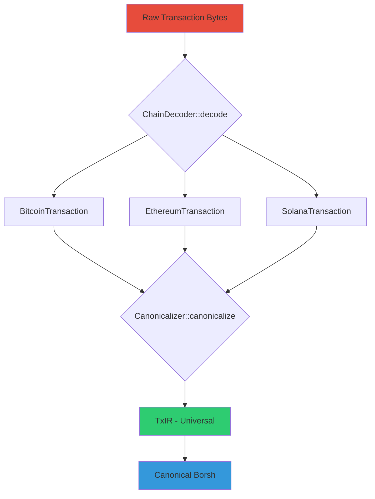
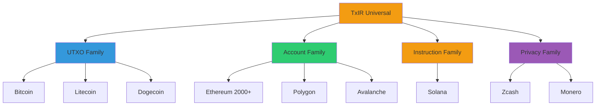

# Type System Visualization Guide

> **For Blog Posts, Papers, Conferences, and Educational Content**

This guide helps you create compelling visualizations of the Universal Blockchain Decoder's type system for various audiences and formats.

---

## Table of Contents

1. [Quick Start](#quick-start)
2. [Available Resources](#available-resources)
3. [Use Cases](#use-cases)
4. [Embedding the Interactive Demo](#embedding-the-interactive-demo)
5. [Creating Custom Visualizations](#creating-custom-visualizations)
6. [Examples for Different Audiences](#examples-for-different-audiences)
7. [Best Practices](#best-practices)

---

## Quick Start

### For Blog Posts

1. **Read the blog post template:** [BLOG_TYPE_SYSTEM_VISUALIZATION.md](./BLOG_TYPE_SYSTEM_VISUALIZATION.md)
2. **Embed the interactive demo:** Use the iframe code below
3. **Use comparison examples:** [CHAIN_COMPARISON_EXAMPLES.md](./CHAIN_COMPARISON_EXAMPLES.md)

### For Academic Papers

1. **Use formal diagrams:** See "Decoding Pipeline" and "Type Hierarchy" sections in the blog post
2. **Reference the architecture:** Point to trait-based extensibility design
3. **Include statistics:** 2200+ chains, 4 families, 1 universal type

### For Conferences/Talks

1. **Live demo:** Use the interactive WASM demo (works offline!)
2. **Side-by-side comparisons:** Show Bitcoin vs Ethereum vs Solana
3. **Family grouping:** Visualize the 4 chain families

---

## Available Resources

### Documentation

| Resource | Purpose | Audience |
|----------|---------|----------|
| [BLOG_TYPE_SYSTEM_VISUALIZATION.md](./BLOG_TYPE_SYSTEM_VISUALIZATION.md) | Complete blog post with diagrams | General developers |
| [CHAIN_COMPARISON_EXAMPLES.md](./CHAIN_COMPARISON_EXAMPLES.md) | Detailed comparison examples | Technical readers |
| [ARCHITECTURE.md](./ARCHITECTURE.md) | Formal system architecture | Engineers |
| [ROADMAP.md](../ROADMAP.md) | Development timeline | Contributors |

### Interactive Demo

| Component | URL | Purpose |
|-----------|-----|---------|
| Main Decoder | `crates/universal-decoder-wasm/www/index.html` | Decode transactions |
| Type Visualization | `crates/universal-decoder-wasm/www/comparison.html` | Compare chains |
| Live Demo | https://prasincs.github.io/universal-blockchain-decoder/ | Public access |

### Visual Assets

```
docs/
├── BLOG_TYPE_SYSTEM_VISUALIZATION.md  # Blog post with ASCII diagrams
├── CHAIN_COMPARISON_EXAMPLES.md       # Side-by-side examples
└── TYPE_SYSTEM_VISUALIZATION_GUIDE.md # This file

crates/universal-decoder-wasm/www/
├── index.html           # Main decoder demo
├── comparison.html      # Type system visualization
├── comparison.css       # Styling
└── comparison.js        # Interactive logic
```

---

## Use Cases

### 1. Blog Posts / Articles

**Goal:** Explain how the type system unifies blockchains

**Resources to Use:**
- Main narrative: [BLOG_TYPE_SYSTEM_VISUALIZATION.md](./BLOG_TYPE_SYSTEM_VISUALIZATION.md)
- Examples: [CHAIN_COMPARISON_EXAMPLES.md](./CHAIN_COMPARISON_EXAMPLES.md)
- Interactive embed: See below

**Structure:**
```markdown
# How 2200+ Blockchains Share One Type System

## Introduction
[Use the "Core Insight" section from blog post]

## The TxIR Type
[Copy the type breakdown with examples]

## Four Chain Families
[Use the family comparison diagram]

## Interactive Demo
[Embed iframe]

## Conclusion
[Summarize universal properties]
```

**Embed Code:**
```html
<iframe
    src="https://prasincs.github.io/universal-blockchain-decoder/comparison.html"
    width="100%"
    height="1000px"
    frameborder="0"
    style="border-radius: 8px; box-shadow: 0 4px 12px rgba(0,0,0,0.1);"
    allow="clipboard-read; clipboard-write">
</iframe>
```

### 2. Academic Papers

**Goal:** Formally describe the type system architecture

**Resources to Use:**
- Architecture diagrams from blog post
- Formal properties from [FORMAL_VERIFICATION.md](./FORMAL_VERIFICATION.md)
- Chain statistics

**Structure:**
```latex
\section{Universal Transaction Representation}

\subsection{TxIR Type Definition}
% Use Rust code from blog post, formatted for LaTeX

\subsection{Chain Family Taxonomy}
% Table of 4 families with characteristics

\subsection{Formal Properties}
% From FORMAL_VERIFICATION.md:
% - VT-1: Canonicalization injectivity
% - VT-2: Panic-freedom
% - VT-3: Determinism

\subsection{Evaluation}
% Statistics: 2200+ chains, 32 decoders, 0 core changes
```

**Key Diagrams:**

1. **Decoding Pipeline** (from blog post)
2. **Type Hierarchy** (from blog post)
3. **Chain Family Grouping** (from blog post)

**Export as PDF:**
```bash
# Convert markdown diagrams to PDF figures
pandoc docs/BLOG_TYPE_SYSTEM_VISUALIZATION.md \
  -o paper_figures.pdf \
  --pdf-engine=xelatex
```

### 3. Conference Talks / Presentations

**Goal:** Live demonstration with visual impact

**Resources to Use:**
- Interactive demo (works offline after initial load!)
- Comparison page for side-by-side views
- Chain family cards for taxonomy

**Slide Structure:**

**Slide 1: The Problem**
- Bitcoin uses UTXOs
- Ethereum uses accounts
- Solana uses instructions
- How to analyze them all?

**Slide 2: The Solution**
- TxIR: Universal Intermediate Representation
- [Show TxIR type definition]

**Slide 3: Live Demo**
- [Open comparison.html]
- Decode Bitcoin transaction
- Decode Ethereum transaction
- Show unified TxIR

**Slide 4: The Four Families**
- [Screenshot of family grid from comparison.html]
- UTXO, Account, Instruction, Privacy

**Slide 5: Scale**
- 2200+ blockchains
- 4 families
- 1 type
- 0 core changes

**Offline Demo Setup:**
```bash
# Before conference (requires internet)
cd crates/universal-decoder-wasm
./build.sh

# At conference (no internet needed)
cd www
python3 -m http.server 8080
# Open http://localhost:8080/comparison.html
```

### 4. Educational Content / Tutorials

**Goal:** Teach blockchain transaction models

**Resources to Use:**
- [CHAIN_COMPARISON_EXAMPLES.md](./CHAIN_COMPARISON_EXAMPLES.md) for step-by-step walkthrough
- Interactive demo for hands-on exercises

**Lesson Plan:**

**Module 1: Transaction Models**
- UTXO (Bitcoin)
- Account (Ethereum)
- Instruction (Solana)
- [Use examples from CHAIN_COMPARISON_EXAMPLES.md]

**Module 2: Universal Abstraction**
- What do all transactions have in common?
- Authorization, Operations, State Changes
- [Use TxIR type breakdown from blog post]

**Module 3: Hands-On**
- Decode a Bitcoin transaction
- Decode an Ethereum transaction
- Compare the TxIR outputs
- [Use interactive demo]

**Module 4: Privacy**
- Transparent vs Shielded
- Zcash example
- Privacy primitives
- [Use privacy section from blog post]

### 5. Marketing / Product Pages

**Goal:** Demonstrate capabilities to potential users

**Key Messages:**
- "2200+ blockchains, one type system"
- "Zero-trust decoding in your browser"
- "Universal transaction analysis"

**Visual Elements:**
- Chain family grid (colorful cards)
- Statistics (big numbers)
- Interactive demo (trust through transparency)

**Call-to-Action:**
- "Try the demo" → Link to comparison.html
- "Read the docs" → Link to GitHub
- "Integrate now" → Link to Rust crate

---

## Embedding the Interactive Demo

### Full Page Embed

```html
<iframe
    src="https://prasincs.github.io/universal-blockchain-decoder/comparison.html"
    width="100%"
    height="1200px"
    frameborder="0"
    allow="clipboard-read; clipboard-write">
</iframe>
```

### Specific Section (using URL fragments)

```html
<!-- Jump to chain families -->
<iframe
    src="https://prasincs.github.io/universal-blockchain-decoder/comparison.html#chain-families"
    width="100%"
    height="800px"
    frameborder="0">
</iframe>

<!-- Jump to type explorer -->
<iframe
    src="https://prasincs.github.io/universal-blockchain-decoder/comparison.html#txir-explorer"
    width="100%"
    height="1000px"
    frameborder="0">
</iframe>
```

### Responsive Embed

```html
<div style="position: relative; padding-bottom: 56.25%; height: 0; overflow: hidden;">
    <iframe
        src="https://prasincs.github.io/universal-blockchain-decoder/comparison.html"
        style="position: absolute; top: 0; left: 0; width: 100%; height: 100%; border: 0;"
        allow="clipboard-read; clipboard-write">
    </iframe>
</div>
```

### Self-Hosted (for offline events)

```bash
# 1. Clone repository
git clone https://github.com/prasincs/universal-blockchain-decoder.git
cd universal-blockchain-decoder

# 2. Build WASM
cd crates/universal-decoder-wasm
./build.sh

# 3. Serve locally
cd www
python3 -m http.server 8080

# 4. Open http://localhost:8080/comparison.html
```

---

## Creating Custom Visualizations

### Using the Blog Post Diagrams

All ASCII diagrams in [BLOG_TYPE_SYSTEM_VISUALIZATION.md](./BLOG_TYPE_SYSTEM_VISUALIZATION.md) can be:

1. **Copied directly** into markdown/text
2. **Converted to images** using tools like:
   - [carbon.now.sh](https://carbon.now.sh/) - Beautiful code screenshots
   - [asciinema](https://asciinema.org/) - Terminal recordings
   - [mermaid.live](https://mermaid.live/) - Convert to Mermaid diagrams

3. **Styled for presentations** using:
   - Monospace fonts (Courier New, Fira Code, JetBrains Mono)
   - Dark backgrounds (#1a1a2e)
   - Syntax highlighting (Dracula, Monokai, Nord themes)

### Creating Mermaid Diagrams

**Decoding Pipeline:**



**Chain Family Hierarchy:**



### Exporting Diagrams

**To PNG/SVG:**
```bash
# Using Mermaid CLI
npm install -g @mermaid-js/mermaid-cli

# Convert to PNG
mmdc -i diagram.mmd -o diagram.png -b transparent

# Convert to SVG
mmdc -i diagram.mmd -o diagram.svg
```

**To PDF:**
```bash
# Using Pandoc
pandoc diagram.md -o diagram.pdf --pdf-engine=xelatex
```

---

## Examples for Different Audiences

### For Developers (Technical)

**Focus:**
- Code examples (Rust TxIR definition)
- Trait system architecture
- Decoding pipeline details

**Best Resources:**
- [BLOG_TYPE_SYSTEM_VISUALIZATION.md](./BLOG_TYPE_SYSTEM_VISUALIZATION.md) (full technical details)
- [CHAIN_COMPARISON_EXAMPLES.md](./CHAIN_COMPARISON_EXAMPLES.md) (code-heavy)

**Tone:**
- Technical, precise
- Use Rust code snippets
- Explain const generics, lifetimes, trait bounds

### For Executives (Business)

**Focus:**
- Scale (2200+ chains)
- Efficiency (0 core changes)
- Value proposition (universal analytics)

**Best Resources:**
- Statistics section from blog post
- Chain family grid visual
- High-level TxIR diagram

**Tone:**
- Business value, not technical details
- "Single integration supports 2200+ blockchains"
- "Zero vendor lock-in through open-source Rust"

### For Researchers (Academic)

**Focus:**
- Formal properties (injectivity, determinism)
- Taxonomy (4 chain families)
- Extensibility (trait-based architecture)

**Best Resources:**
- Architecture diagrams
- [FORMAL_VERIFICATION.md](./FORMAL_VERIFICATION.md) properties
- Type hierarchy

**Tone:**
- Formal, rigorous
- Cite formal verification plans
- Reference academic blockchain papers

### For Students (Educational)

**Focus:**
- Understanding transaction models
- Hands-on decoding
- Visual comparisons

**Best Resources:**
- Interactive demo (primary)
- [CHAIN_COMPARISON_EXAMPLES.md](./CHAIN_COMPARISON_EXAMPLES.md) (step-by-step)
- Family grid (visual taxonomy)

**Tone:**
- Approachable, explanatory
- Use analogies ("UTXO = cash", "Account = bank account")
- Encourage experimentation with demo

---

## Best Practices

### ✅ Do

- **Use the interactive demo** - It's the most compelling demonstration
- **Show side-by-side comparisons** - Bitcoin vs Ethereum vs Solana
- **Emphasize universality** - "Same operation, different encoding"
- **Include real examples** - Use actual mainnet transaction data
- **Link to source code** - Build trust through transparency
- **Test offline** - Conference WiFi is unreliable

### ❌ Don't

- **Oversimplify** - The type system is sophisticated, don't hide complexity
- **Focus on single chains** - The power is in multi-chain support
- **Ignore privacy** - It's a first-class feature, not an afterthought
- **Use fake data** - Always use real blockchain transactions
- **Forget accessibility** - Ensure visualizations work on mobile

### Color Palette (for consistency)

```
UTXO Family:      #3498db (blue)
Account Family:   #2ecc71 (green)
Instruction:      #f39c12 (orange)
Privacy:          #9b59b6 (purple)

Background:       #0f0f23 (dark blue)
Cards:            #1a1a2e (slightly lighter)
Text:             #ecf0f1 (off-white)
Accent:           #e74c3c (red)
```

### Typography

- **Code:** Courier New, Fira Code, JetBrains Mono
- **Headings:** Inter, Roboto, system-ui
- **Body:** system-ui, -apple-system, sans-serif

---

## Checklist for Creating Content

### Before You Start

- [ ] Identify your audience (developers, executives, researchers, students)
- [ ] Choose the appropriate tone and technical depth
- [ ] Decide on format (blog, paper, talk, tutorial)

### During Creation

- [ ] Use consistent terminology (TxIR, not "intermediate format")
- [ ] Include at least 3 chain examples (Bitcoin, Ethereum, Solana)
- [ ] Show both similarities AND differences
- [ ] Link to interactive demo for hands-on exploration
- [ ] Cite statistics (2200+ chains, 4 families, etc.)

### Before Publishing

- [ ] Test all embedded iframes/demos
- [ ] Verify all links work
- [ ] Check mobile responsiveness
- [ ] Proofread for accuracy (chain IDs, hash algorithms, etc.)
- [ ] Include call-to-action (try demo, read docs, contribute)

---

## Getting Help

- **GitHub Issues:** https://github.com/prasincs/universal-blockchain-decoder/issues
- **Discussions:** https://github.com/prasincs/universal-blockchain-decoder/discussions
- **Documentation:** https://github.com/prasincs/universal-blockchain-decoder/tree/main/docs

---

## Example Use Cases in the Wild

### Blog Post
> "Understanding Blockchain Transaction Models Through a Universal Type System"
> - Medium article using embedded demo
> - Target: 10-minute read for developers
> - Focus: UTXO vs Account vs Instruction models

### Conference Talk
> "One Type to Rule Them All: Unifying 2200+ Blockchains"
> - 20-minute presentation at blockchain conference
> - Live demo showing Bitcoin, Ethereum, Solana side-by-side
> - Q&A using type explorer

### Academic Paper
> "A Type-Theoretic Approach to Multi-Chain Transaction Analysis"
> - ICBC 2025 submission
> - Formal verification section
> - Evaluation: 32 decoders, 2200+ chains

### Tutorial Series
> "Blockchain Transaction Internals: A Comparative Study"
> - 5-part YouTube series
> - Each episode covers one family (UTXO, Account, Instruction, Privacy)
> - Hands-on exercises using interactive demo

---

**Last Updated:** 2025-11-16
**Version:** 1.0.0
**Maintainer:** Universal Blockchain Decoder Team
